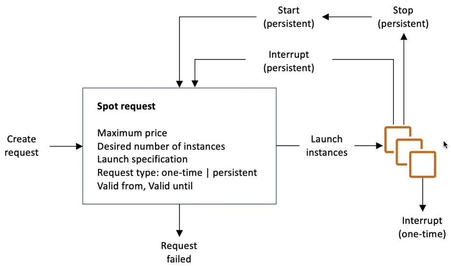

# Amazon EC2

- Mainly consists the capability of:
  - Renting virtual machines (EC2)
  - String data in virtual drives (EBS)
  - Distributing load across machines (ELB)
  - Scaling the services using an auto-scaling group (ASG)

## Sizing and Configuration Options

- Operating System, CPU and RAM
- Storage Space
  - Network-attached (EBS & EFS)
  - Hardware (EC2 Instance Store)
- Network card: speed of the card, Public IP address
- Firewall rules

## Bootstrap script

- Launching commands, only once, when a machine starts.
- Tasks such as installing software or updates, etc.
- Script runs with root user.

## EC2 Instance Types

- General Purpose
  - Balanced between Compute, Memory and Networking
- Compute Optimized
  - Compute-intensive tasks
- Memory Optimized
  - Fast performance for workloads that process large data sets in memory.
- Accelerated Computing
- Storage Optimized
  - Storage-intensive tasks
- HPC Optimized
- Instance Features
- Measuring Instance Performance

## Security Groups

- Controls how the traffic is allowed into or out of EC2 Instances.
- Only contain allow rules.
- Group rules can reference by IP or by security group.
- Can be attached with multiple instances.
- Locked down to a region or VPC combination.
- Main a separate security group for SSH access.
- All inbound is blocked by default and all outbound is authorized by default.

## Classic Ports

- 22: SSH, SFTP (Secure File Transfer Protocol; upload via SSH)
- 21: FTP (File Transfer Protocol)
- 80: HTTP
- 443: HTTPS
- 3389: RDP (Remote Desktop Protocol; windows instance)

## EC2 Instances Purchasing Options

- On-Demand Instances: pay by second
- Reserved (1 and 3 years): 72% discount compared to on-demand
- Savings Plans (1 and 3 years): 72% discount; commitment to the amount of usage
- Spot Instances: 90% discount, cheap, can lose instances, not suitable for critical jobs.
- Dedicated Hosts: entire physical server, most expensive, bring your own license
- Dedicated Instances: own a hardware
- Capacity Reservations: reserve capacity in specific AZ.

## EC2 Spot Instance Requests

- Discount upto 90% compared to on-demand.
- Define **max spot price**, get instance while **current spot price < max**.
- If spot prices > max, choose to stop or terminate the instance with 2 min grace period.

### Spot Fleets

- Spot Fleets = set of Spot Instances + (optional) On-Demand Instances
- Spot Fleets allows us to automatically request spot instances with lowest price.
## Placement Groups
- EC2 instance placement strategy can be defined using placement groups.
- In placement group, you specify one of the following strategies
## Cluster

- Pros: Great Network
- Cons: If AZ fails, all instances fails.
### Spread

- Pros: Reduced risk of simultaneous failure, instances on different physical hardware.
- Cons: Limited to 7 instances / AZ / placement group.
### Partition

- Upto 7 partitions / AZ.
- Mutiple AZs in the same region.
- 100s of EC2 instances.
- Instancess in partitions do not share racks.
## Elastic Network Interfaces (ENI)
- Logical component on a VPC that represents a Virtual Network Card.
- ENI have the following attributes.
	- Primary private IPv4, one or more secondary.
	- One Elastic IP (IPv4) per private IPv4.
	- One Public IPv4
	- One or more security groups.
- Can create ENI independently and move them on EC2 instances for failovers.
- Bound to specific AZ.
## EC2 Hibernate
- OS is not stopped / restarted.
- Root EBS volume must be encrypted.
- Instance cannot be hibernate for more than 60 days.

## EC2 Instance Store
- High-performance hardware disk
- Better I/O performance
- Lose storage, if they are stopped.
- Risk of data loss if the hardware fails.
- Backups and replications are user responsibility.